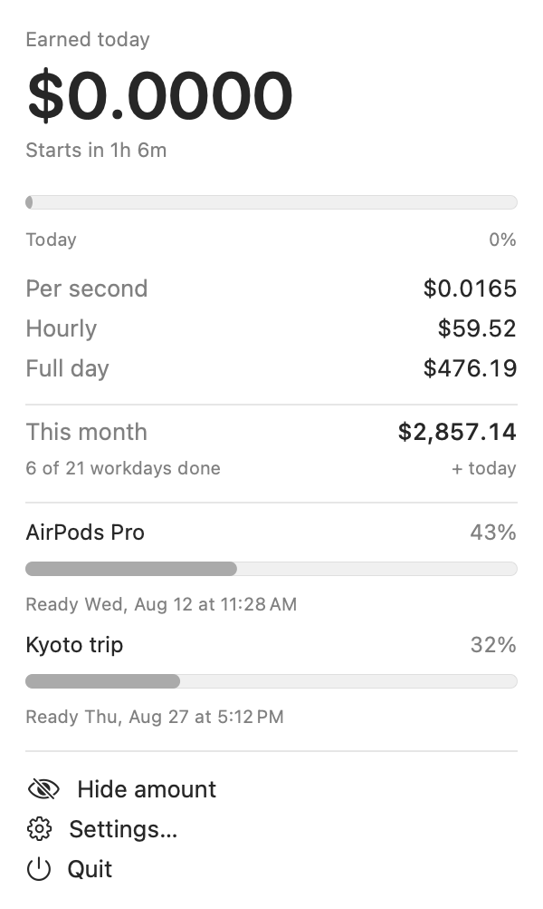
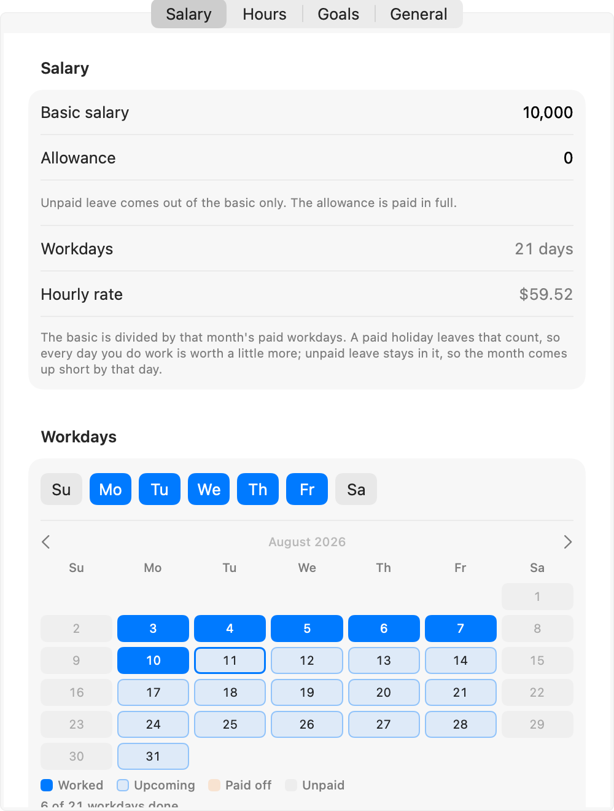

# SalaryTicker

<!-- language-bar -->
[English](README.md) · [简体中文](README.zh-CN.md) · [日本語](README.ja.md) · **한국어** · [Español](README.es.md) · [Français](README.fr.md) · [Deutsch](README.de.md) · [Português](README.pt.md) · [Bahasa Melayu](README.ms.md)
<!-- language-bar -->

오늘 지금까지 번 금액을 1초마다 갱신해 보여주는 macOS 메뉴 막대 앱입니다.



메뉴 막대에는 금액과 작은 진행 링이 자리합니다. 클릭하면 오늘의 상세 내역, 이번 달 누계, 그리고 모으고 있는 것까지 얼마나 남았는지가 나옵니다.

- **1초 단위로 올라갑니다.** 실제 일정, 즉 근무 시간, 무급 점심시간, 근무일을 그대로 반영합니다.
- **휴가를 압니다.** 공휴일, 유급 휴무, 무급 휴무는 각각 다른 곳에 반영되며, 무급 휴무는 수당이 아니라기본급만 건드립니다.
- **가격을 노동으로 환산합니다.** 목표는 돈만이 아니라 근무일 수와, 일정에 따라 그 값을 다 모으게 되는 날짜로 표시됩니다.
- **9개 언어**, 원하는 통화 기호, 원하는 IANA 시간대.
- **계정 없음, 네트워크 없음, 사용 정보 수집 없음.** 모든 계산은 직접 입력한 설정만으로 이 Mac 안에서 이루어집니다.

## 설치

**macOS 26 이상**과 Swift 6 툴체인이 필요합니다. Swift 6.3으로 빌드하고 테스트했으며, 그 이전 Swift 6 릴리스는 검증하지 않았습니다.

```bash
git clone https://github.com/EnRui11/SalaryTicker.git
cd SalaryTicker
./Packaging/build_app.sh install
```

이 명령은 릴리스 바이너리를 빌드하고, 소스에서 앱 아이콘을 생성하고, `SalaryTicker.app`을 조립한뒤 애드혹 서명하고, `/Applications`에 복사한 다음 실행합니다. `install` 인자를 빼면 설치 없이 작업디렉터리에 빌드만 합니다.

격리(quarantine)를 풀 일은 없습니다. 바이너리를 직접 컴파일했으므로 Gatekeeper가 찾는 다운로드 표시가 애초에 붙지 않습니다. 서명은 애드혹이지만 로컬에서 빌드한 앱에는 그것으로 충분하고, 로그인 항목에 안정적인 신원을 부여합니다.

업데이트하려면 pull한 뒤 같은 명령을 실행하세요. 설치된 사본을 교체하고 다시 실행합니다. 설정은 번들 밖에 저장되므로 그대로 유지됩니다.

제거하려면 패널에서 종료하고 `/Applications/SalaryTicker.app`을 삭제하세요. 설정까지 지우려면 `defaults delete com.steve.salaryticker`를 실행하면 됩니다.

## 첫 실행

일정이 말이 될 때까지 메뉴 막대에는 `급여 설정`이 표시됩니다. 패널에서 **설정**을 열고 세 가지를 채우세요.

1. **급여 탭**: 기본급, 그리고 그 옆의 고정 수당.
2. **근무 시간 탭**: 출근, 퇴근, 점심시간 무급.
3. **급여 탭의 근무일**: 어떤 요일에 일하는지, 그중 어떤 날이 반일인지.



여기까지면 시작할 수 있습니다. 나머지는 모두 선택 사항입니다.

## 설정하기

### 기본급과 수당

필드가 두 개인 이유는, 급여명세서에 최소 두 줄이 있고 휴가가 그 둘을 다르게 다루기 때문입니다.

- **기본급**은 무급 휴무가 공제되는 부분입니다.
- **수당**은 교통비나 통신비처럼 매달 고정으로 나오는 금액이며, 무급 휴가를 썼든 안 썼든 전액지급됩니다.

수당이 없다면 0으로 두면 되고 달라지는 것은 없습니다. 있다면, 둘을 제대로 나누는 것이 무급 휴무하루를 실제보다 비싸게 계산하지 않도록 막아 줍니다.

### 근무일, 공휴일, 휴가

일하는 요일을 고르고, 그중 **반일**인 날을 표시하세요. 예를 들면 토요일 오전이 그렇습니다. 표시한 날은 모든 계산에서 반나절로 취급됩니다.

달력에서 날짜를 클릭하면 **근무일 → 유급 휴무 → 무급 휴무 → 근무일** 순으로 순환합니다. 제목양옆의 화살표로 달을 넘기고, 제목 자체를 누르면 이번 달로 돌아옵니다. 그래서 내년 공휴일도 미리넣어 둘 수 있습니다.

두 종류의 휴가는 서로 다른 곳에 반영되며, 바로 그 차이가 핵심입니다.

|                  | 하는 일                                                                                                                                                                                  |
| ---------------- | ---------------------------------------------------------------------------------------------------------------------------------------------------------------------------------------- |
| **유급** 휴무    | 손해가 없습니다. 같은 급여가 더 적은 근무일에 나뉘므로, 실제로 *일하는* 하루하루의 가치가 조금씩 올라갑니다. 휴무 당일에는 아무것도 올라가지 않고, 그날 몫은 나머지 날에 실려 갑니다. |
| **무급** 휴무    | **기본급** 하루치만큼 손해입니다. 수당은 그대로 전액 들어옵니다.                                                                                                                        |

알아 둘 만한 결과가 하나 있습니다. **이미 지나간** 날을 유급 휴무로 표시하면 이번 달 누계가 줄어듭니다. 그날 몫을 이제 남은 날에 벌어야 하기 때문입니다. 월말이 되면 결국 급여 금액으로 되돌아옵니다.

### 초과 근무

기본값은 꺼짐입니다. 켜면 퇴근 이후에도 지정한 가산율로 계속 계산합니다.

여기에는 **상한**이 있습니다. 기본은 네 시간이고, 자정을 넘기는 일도 없습니다. 앱은 실제로 몇 시에 퇴근했는지 알 수 없기 때문입니다. 상한이 없으면 밤새 켜 둔 Mac이 저녁 내내 일한 급여를 지어냅니다.

### 목표

모으고 있는 것들을 추가하세요. 각 항목은 그 값이 **근무일** 며칠에 해당하는지, 그리고 일정에 따라 언제 다 모으게 되는지를 보여줍니다. 원하는 항목은 패널에 표시해 두고, 나머지는 설정에만 남습니다.

**각 항목 옆의 화살표로, 또는 끌어서 순서를 바꿉니다.** 1링깃은 한 번만 쓸 수 있으므로 목표는 목록 위에서부터 차례로 채워집니다. 위의 목표를 다 채운 뒤에야 아래 목표가 모이기 시작하고, 그 기다림은 날짜에 포함됩니다. 이미 어떤 목표에 들어간 돈은 그대로 남습니다. 새 목표를 맨 위에 놓아도 오래된 목표가 이미 받은 몫을 되찾아가지 않습니다.

날짜는 **일하는 동안 움직이지 않습니다.** 버는 금액과 시계가 함께 나아가므로, 일정을 지키는 한 날짜는약속대로 지켜집니다. 그 날짜를 움직이는 것은 아래에 깔린 일정을 바꿀 때뿐입니다. 휴가를 표시하거나, 근무일을 빼거나, 근무 시간을 줄이는 경우입니다.

### 메뉴 막대

| 옵션                          | 하는 일                                                                                  |
| ----------------------------- | ---------------------------------------------------------------------------------------- |
| 진행 링                       | 금액 옆의 작은 링, 하루가 지나는 만큼 채워집니다                                        |
| 통화 기호                     | 표시하거나 숨겨서 가로 폭을 한 글자 되찾습니다                                          |
| 근무 시간 외에는 아이콘만     | 금액이 움직이지 않을 때 항목을 접습니다. 저녁, 주말, 출근 전이 그렇습니다               |
| **금액 숨기기**               | 시계가 뭐라고 하든, 다시 꺼낼 때까지 메뉴 막대에서 금액을 치웁니다                      |

**금액 숨기기**는 패널의 첫 번째 항목이기도 해서 메뉴 막대에서 한 번만 클릭하면 됩니다. 통화가시작되거나 누가 어깨너머로 화면을 볼 때를 위한 것입니다. *전부* 숨기지는 않습니다. 링은 남습니다. 안 그러면 금액을 다시 불러올 클릭 대상이 사라지기 때문입니다.

### 로그인 시 실행

앱이 `/Applications`에서 실행되고 있어야 합니다. 저장되는 값은 요청한 그대로입니다. 토글이 켜져 있으면 앱은 시작할 때 스스로를 등록하고, 등록을 해제하는 일은 절대 없습니다. macOS는 메뉴 막대 앱이 한 번 실행된 것만으로도 로그인 항목에 올려 두며, 그 대답은 어느 쪽으로도 믿을 수 없기 때문입니다.

## 금액을 계산하는 방법

```
basic per day     = basic salary ÷ (scheduled days − paid leave)
allowance per day = allowance    ÷ (scheduled days − all leave)
per second        = (basic per day + allowance per day) ÷ paid seconds per day
today             = paid seconds elapsed today × per second
this month        = days already earned × daily pay + today
```

두 나눗셈의 분모는 모두 **실제 달력의 한 달**을 기준으로 셉니다. 그래서 온전히 일한 달은 정확히 급여 금액과 맞아떨어지고, 일당은 달마다 조금씩 달라집니다. 2026년 8월은 근무일이 21일, 9월은 22일, 2027년 2월은 20일입니다.

하루 유급 시간은 출근, 퇴근, 점심시간에서 나옵니다. 별도의 "하루 근무 시간" 필드가 없으므로 둘이 서로 어긋날 일이 없습니다.

### 틀어질 수 없습니다

갱신할 때마다 `(settings, now)`에서 다시 계산하며 **아무것도 누적하지 않습니다**. 덮개를 닫든, 잠자기에 들든, 종료했다 다시 실행하든, 시스템 시계를 바꾸든, 시간대를 넘나들며비행하든, 그 무엇도 금액을 틀리게 만들 수 없습니다. 틀어질 누적 합계라는 것이 아예 없기 때문입니다.

타이머는 "다시 그릴 시간"이라고 알릴 뿐입니다. 세지는 않으며, 금액이 멈춰 있을 때는 20초 간격으로늘어져 쉽니다. 대부분의 저녁과 모든 주말이 그렇습니다.

### 일시정지 버튼은 일부러 없습니다

계산은 유급 시간대의 양 끝에서 포화합니다. 근무일이 시작되기 직전은 0이고, 끝난 직후는 하루치 전액입니다. 그래서 금액은 **퇴근 후 저절로 멈추고 자정에 저절로 초기화됩니다.** 멈출 타이머도, 되돌릴 상태도 없습니다.

수동 일시정지가 잠깐 있긴 했습니다. 앱에서 유일하게 누적되는 상태였고, 최악의 버그 두 개가 모두거기서 나왔습니다. 밤새 켜 둔 일시정지는 꼬박 하루치보다 많은 금액을 매기고 다음 날을 0으로 만들었고, 퇴근 후에 시작한 일시정지는 이미 확정된 하루 합계를 *거꾸로* 돌렸습니다. 기능을 지우자 그 부류의 버그가 통째로 사라졌습니다.

## 알려진 한계

- **야간 교대 미지원.** 퇴근은 출근보다 늦어야 하며, 그렇지 않으면 앱은 틀린 금액을 보여주는 대신 "설정 미완료"라고 표시합니다.
- **보너스 없음.** 매달 고정으로 나오는 수당만 다룹니다. 비정기 상여나 연말 상여가 여기 나오려면초당 금액으로 분할해 넣어야 하는데, 그것은 금액을 설명하는 게 아니라 부풀리는 일입니다.
- **세금, EPF, SOCSO 없음.** 모든 수치는 세전 총액입니다.
- **이력 없음.** 이번 달 누계는 이번 달 일정에서 계산한 값이지, 실제로 일한 기록에서 나온 값이 아닙니다. 급여나 근무 시간을 수정하면 이번 달의 이미 지나간 날들도 새 단가로 다시 계산됩니다.
- **일정은 하나뿐.** 격주 토요일이나 교대 순환처럼 주 단위로 반복되지 않는 패턴은, 예외를 손으로 표시하는 것 말고는 표현할 방법이 없습니다.

## 개발

```bash
make                 # list every target
make test            # 268 tests
make install         # the Mac app, into /Applications
make run             # the iPhone app, on the simulator
```

기능 우선 클린 아키텍처이며, 레이어마다 SwiftPM 타깃을 하나씩 둡니다. 그래서 의존성 방향이 규율이 아니라 컴파일러로 강제됩니다. 설계 결정, 금액 모델의 불변식, 그리고 그것들을 만들어 낸 버그들은 [docs/ARCHITECTURE.md](docs/ARCHITECTURE.md)에 정리해 두었습니다.

## 라이선스

MIT입니다. [LICENSE](LICENSE)를 참고하세요.
