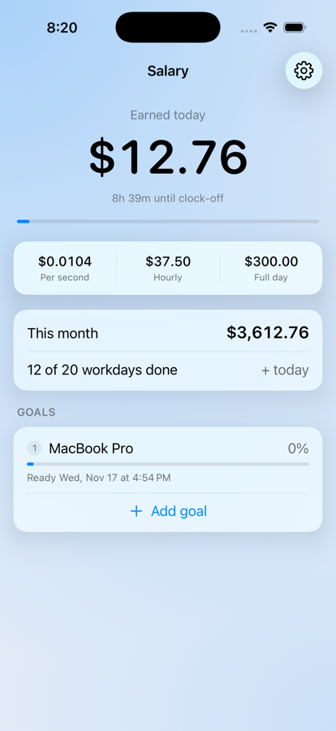
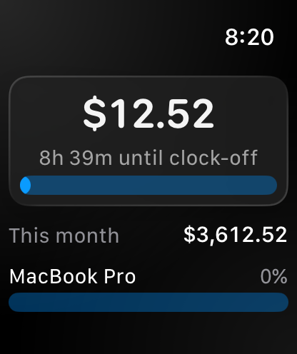

# SalaryTicker

<!-- language-bar -->
[English](README.md) · [简体中文](README.zh-CN.md) · [日本語](README.ja.md) · [한국어](README.ko.md) · [Español](README.es.md) · [Français](README.fr.md) · [Deutsch](README.de.md) · **Português** · [Bahasa Melayu](README.ms.md)
<!-- language-bar -->

Quanto já ganhou hoje, a contar a cada segundo — na barra de menus do Mac, no iPhone, no Apple Watch e na Dynamic Island.


Fica na barra de menus como um número e um pequeno anel de progresso. Clique nele para ver o detalhe do dia, o mês até agora e o quanto falta para aquilo para que está a poupar.

- **Conta a cada segundo** de acordo com o seu horário real — jornada, almoço não remunerado, dias úteis.
- **Entende de folgas.** Feriados, folgas pagas e folgas sem pagamento caem em lugares diferentes, e a folga sem pagamento só mexe no salário base, nunca nos subsídios.
- **Mede preços em trabalho.** Uma meta aparece em dias de trabalho e na data em que o horário diz que estará paga, não só em dinheiro.
- **Nove idiomas**, qualquer símbolo de moeda, qualquer fuso horário IANA.
- **Sem conta, sem rede, sem telemetria.** Tudo é calculado na sua própria máquina a partir das definições que introduziu.
- **Quatro ecrãs, um único cálculo.** O Mac, o telemóvel, o relógio e a Dynamic Island leem todos o mesmo código de domínio, por isso não podem discordar sobre quanto vale um segundo.

## Instalação

### A app para Mac

Requer **macOS 26 ou posterior** e um toolchain Swift 6. Compilada e testada com o Swift 6.3; versões anteriores do Swift 6 não foram testadas.

```bash
git clone https://github.com/EnRui11/SalaryTicker.git
cd SalaryTicker
make install
```

Isto compila um binário de release, gera o ícone da app a partir do código, monta o `SalaryTicker.app`, assina em modo ad-hoc, copia para `/Applications` e abre a app. O `make app` faz o mesmo sem instalar.

Não há nada para tirar da quarentena: o binário foi compilado por si, por isso nunca traz a marca de transferência que o Gatekeeper procura. A assinatura é ad-hoc, o que basta para uma app compilada localmente e dá ao item de início uma identidade estável.

Para atualizar, faça o pull e execute o mesmo comando — substitui a cópia instalada e reabre a app. As suas definições ficam fora do bundle e não são tocadas.

Para desinstalar: use Sair no painel, apague `/Applications/SalaryTicker.app` e, se quiser eliminar também as definições, `defaults delete com.steve.salaryticker`.

### O iPhone e o Apple Watch

Requer **iOS 26 / watchOS 26**, o Xcode 26 e o [xcodegen](https://github.com/yonaskolb/XcodeGen) (`brew install xcodegen`).

```bash
make run      # the phone, on the iOS Simulator
make watch    # the watch, on the paired watch simulator
```

Por enquanto, só simuladores: todos os targets são compilados com a assinatura de código desligada. Pôr isto em hardware real exige adicionar antes um Apple ID no Xcode, e o perfil de provisionamento de uma conta gratuita expira ao fim de sete dias — passado esse prazo, a app deixa de abrir até a recompilar.

Num iPhone real, a app do relógio não é instalada separadamente. Vem **dentro** da app do telemóvel, por isso instala a app do telemóvel e depois ou deixa a Instalação Automática de Apps ligada, ou abre a app **Watch** do iPhone e toca em Instalar ao lado do SalaryTicker, em Apps Disponíveis. Os simuladores não têm nada dessa maquinaria, e é por isso que o `make watch` põe a app diretamente no relógio.

## Primeira execução

A barra de menus mostra `Definir salário` até que o horário faça sentido. Abra **Definições** pelo painel e preencha três coisas:

1. **Separador Salário** — o seu salário base e qualquer subsídio fixo ao lado dele.
2. **Separador Horário** — entrada, saída e o almoço não remunerado.
3. **Separador Salário, Dias úteis** — em que dias da semana trabalha e quais deles são de meio dia.


Isto já basta para começar. Todo o resto é opcional.

## Como configurar

### Salário base e subsídios

Dois campos, porque um recibo de vencimento tem pelo menos duas linhas e as folgas tratam cada uma de maneira diferente:

- O **salário base** é a parte de onde sai a folga sem pagamento.
- Os **subsídios** são um valor mensal fixo — transporte, telefone — pago por inteiro, com ou sem folga sem pagamento.

Se não recebe subsídio, deixe a zero e nada muda. Se recebe, separar os dois corretamente é o que impede que um dia de folga sem pagamento custe mais do que realmente custa.

### Dias úteis, feriados e folgas

Escolha os seus dias da semana e marque qualquer um deles como **meio dia** (um sábado de manhã, por exemplo) — conta pela metade em todo o lado.

Clique numa data da grelha do mês para percorrer os estados: **dia útil → feriado pago → sem pagamento → dia útil**. As setas dos dois lados do título passam de um mês para outro, e o próprio título é o caminho de volta para hoje, por isso os feriados do próximo ano podem ser lançados antes de chegarem.

Os dois tipos de folga caem em lugares diferentes, e a diferença é justamente o que importa:

|                        | O que faz                                                                                                                                                                                                       |
| ---------------------- | ----------------------------------------------------------------------------------------------------------------------------------------------------------------------------------------------------------- |
| Feriado **pago**       | Não custa nada. O mesmo salário agora cobre menos dias úteis, por isso cada dia que *realmente* trabalha vale um pouco mais. Nada é contado no próprio feriado — a parte dele é carregada pelos outros dias. |
| Folga **sem pagamento** | Custa um dia de salário **base**. Os seus subsídios continuam a chegar por inteiro.                                                                                                                          |

Uma consequência que vale conhecer: marcar como feriado pago um dia que **já passou** faz o acumulado do mês cair, porque a parte daquele dia tem agora de ser ganha nos dias que ainda faltam. No fim do mês, tudo volta a bater com o seu salário.

### Hora extra

Desligada por predefinição. Ligada, continua a contar depois da saída, com um multiplicador que define.

Tem um **limite** — quatro horas por predefinição, e nunca passa da meia-noite — porque a app não faz ideia de quando saiu realmente. Sem um teto, um Mac deixado ligado a noite toda inventaria uma noite inteira de pagamento.

### Metas

Adicione as coisas para que está a poupar. Cada uma mostra quanto custa em **dias de trabalho** e a data em que o horário diz que estará paga. Ative Mostrar no painel nas que quiser; as outras ficam em Definições.

**Reordene-os com as setas ao lado de cada um, ou arrastando.** Um ringgit só pode ser gasto uma vez, por isso os objetivos são financiados de cima para baixo: um objetivo só começa a encher depois de pagos os que estão acima, e a sua data inclui essa espera. O dinheiro já ganho para um objetivo fica lá — pôr um novo no topo não retira o que um mais antigo já recebeu.

A data **não se move enquanto trabalha.** O que ganha e o que o relógio faz avançam juntos, por isso seguir o seu horário cumpre a promessa em vez de a adiar. A única coisa que a desloca é mudar o horário por baixo — marcar uma folga, tirar um dia útil, encurtar a jornada.

### A barra de menus

| Opção                           | O que faz                                                                                        |
| ------------------------------- | ------------------------------------------------------------------------------------------------ |
| Anel de progresso               | Um pequeno anel ao lado do número, que se vai enchendo ao longo do dia                           |
| Símbolo da moeda                | Mostre ou oculte, para recuperar um carácter de largura                                          |
| Apenas ícone fora do horário    | Encolhe o item quando o número não está a andar — à noite, nos fins de semana, antes da entrada |
| **Ocultar valor**               | Tira o dinheiro da barra de menus até o pedir de volta, seja qual for a hora                     |

**Ocultar valor** é também o primeiro item do painel, a um clique da barra de menus, para quando uma chamada está a começar ou alguém está a ler por cima do seu ombro. Nunca esconde *tudo* — o anel permanece, senão não sobraria nada em que clicar para trazer o número de volta.

### Abrir ao iniciar sessão

Exige que a app esteja a correr a partir de `/Applications`. O que fica guardado é o que pediu: a app regista-se no arranque quando a opção está ligada e nunca cancela esse registo, porque o macOS lista apps de barra de menus como itens de início só por terem sido executadas uma vez, e a resposta dele não é fiável em nenhum dos dois sentidos.

## No telemóvel e no relógio

Os mesmos quatro números que o painel mostra, na mesma ordem, porque quem usa os dois não devia ter de aprender a app duas vezes.

 

### Como levar as suas definições para lá

Abra **Definições → Sistema → Enviar para o telemóvel** no Mac e aponte a câmara do telemóvel para o QR code. Tudo vai junto — salário, horário, dias úteis, folgas, metas —, por isso o telemóvel já começa com os seus números em vez dos valores predefinidos.

Por baixo, o que o código codifica é uma ligação. É justamente isso que torna a importação testável: um simulador não tem câmara, mas é possível entregar-lhe um URL.

Contém o seu salário, e é por isso que é uma imagem e não um texto que se possa copiar. Um código num ecrã vai para uma câmara e para mais lado nenhum; no momento em que se tornasse texto num menu de partilha, passaria a ter hipótese de acabar nalgum sítio onde nunca deveria estar.

### O telemóvel

Um único ecrã que se percorre a deslizar, em vez dos separadores do Mac, porque num telemóvel se desliza de qualquer maneira e os separadores esconderiam justamente aquilo que veio mudar atrás de um palpite sobre em que separador a coisa está.

**As metas são adicionadas aqui**, no ecrã principal, e o formulário pede o nome e o preço antes de criar seja o que for. Em Definições é onde as renomeia, muda o preço, reordena e apaga.

### O relógio

A app do relógio não guarda definições próprias e não oferece maneira nenhuma de as introduzir — um relógio não consegue digitalizar um QR code. Espera pelo telemóvel, que envia as definições mais recentes sempre que alguma muda. Por isso a app do telemóvel tem de ter sido aberta pelo menos uma vez, ou o relógio não tem nada para mostrar. Há também uma complicação para o mostrador do relógio.

### A Dynamic Island e o ecrã bloqueado

Ligada em **Definições → Exibição → Dynamic Island**, e desligada aí mesmo quando preferir não ter o seu pagamento no ecrã bloqueado. O iOS tem o seu próprio interruptor para as Atividades Ao Vivo; este aqui só consegue subtrair dele.

O que ali se move, move-se sem nenhum código a correr. O iOS anima a contagem decrescente até à saída e a barra de progresso ao longo de um intervalo fixo de datas, por isso os dois continuam vivos e exatos horas depois da última vez que a app esteve aberta.

**O dinheiro não**, e nem sequer finge que sim. Atualizá-lo exige a app em primeiro plano ou um servidor de push, e aqui não há nem um nem outro — por isso aparece como um valor com a hora a que foi tirado impressa ao lado. Um contador que parou em silêncio é pior do que um que diz quando parou.

Toque sem soltar na ilha para ver a versão expandida. Um **toque abre a app**: o iOS reserva o toque para isso e não oferece maneira de pedir outra coisa.

## Como o número é calculado

```
basic per day     = basic salary ÷ (scheduled days − paid leave)
allowance per day = allowance    ÷ (scheduled days − all leave)
per second        = (basic per day + allowance per day) ÷ paid seconds per day
today             = paid seconds elapsed today × per second
this month        = days already earned × daily pay + today
```

Os dois divisores são contados sobre o **mês real do calendário**, por isso um mês trabalhado por inteiro soma exatamente o seu salário, e o valor diário varia um pouco de mês para mês — agosto de 2026 tem 21 dias úteis, setembro tem 22, fevereiro de 2027 tem 20.

As horas pagas por dia vêm da entrada, da saída e do almoço. Não existe um campo separado de "horas por dia", por isso os dois nunca se podem contradizer.

### Não pode acumular erro

Cada atualização recalcula a partir de `(settings, now)` e **não acumula nada**. Fechar a tampa, dormir, sair e reabrir, mudar o relógio do sistema, atravessar fusos horários de avião — nada disso pode deixar o número errado, porque não existe um total acumulado que possa correr mal.

O timer só diz "hora de redesenhar". Não conta, e abranda para uma soneca de 20 segundos sempre que o número está congelado, o que acontece na maioria das noites e em todos os fins de semana.

### Não há botão de pausa, de propósito

A contagem satura nas duas pontas da janela paga: um instante antes do horário de trabalho vale zero, um instante depois vale um dia inteiro. Por isso o número **para sozinho depois da saída e volta a zero sozinho à meia-noite** — não há timer para parar, nem estado para reiniciar.

Uma pausa manual existiu por pouco tempo. Era o único estado acumulado da app e a origem dos seus dois piores bugs: uma pausa deixada a correr a noite toda cobrava mais do que um dia inteiro de trabalho e punha o seguinte a zero, e uma pausa iniciada depois da saída fazia o total diário já fechado andar *para trás*. Apagar a funcionalidade apagou a classe inteira de bugs.

## Limitações conhecidas

- **Sem turnos noturnos.** A saída tem de ser depois da entrada; caso contrário, a app diz "Configuração incompleta" em vez de mostrar um número errado.
- **Sem bónus.** Só um subsídio mensal fixo é modelado. Um pagamento eventual ou de fim de ano teria de ser diluído num valor por segundo para aparecer aqui, e isso maquilha o número em vez de o descrever.
- **Sem imposto, EPF ou SOCSO.** Todos os valores são brutos.
- **Sem histórico.** O acumulado do mês é derivado do horário deste mês, não de um registo do que foi realmente trabalhado. Editar o seu salário ou o seu horário volta a fixar o preço dos dias que já ficaram para trás no mês corrente.
- **Um único horário.** Um padrão que não seja semanal — sábados alternados, uma escala de turnos — não pode ser expresso, a não ser marcando as exceções à mão.
- **Só simuladores no iOS.** Nada aqui é assinado para hardware real, e o perfil de uma conta Apple gratuita dura sete dias, por isso um telemóvel e um relógio que andem realmente consigo teriam de ser reinstalados todas as semanas.

## Desenvolvimento

```bash
make                 # list every target
make test            # 276 tests
make install         # the Mac app, into /Applications
make run             # the iPhone app, on the simulator
make watch           # the watch app, on the paired watch simulator
```

Clean Architecture orientada a funcionalidades, um target SwiftPM por camada, para que a direção das dependências seja imposta pelo compilador, e não pela disciplina. As decisões de conceção, os invariantes do modelo de dinheiro e os bugs que os moldaram estão descritos em [docs/ARCHITECTURE.md](docs/ARCHITECTURE.md).

## Licença

MIT — consulte [LICENSE](LICENSE).
